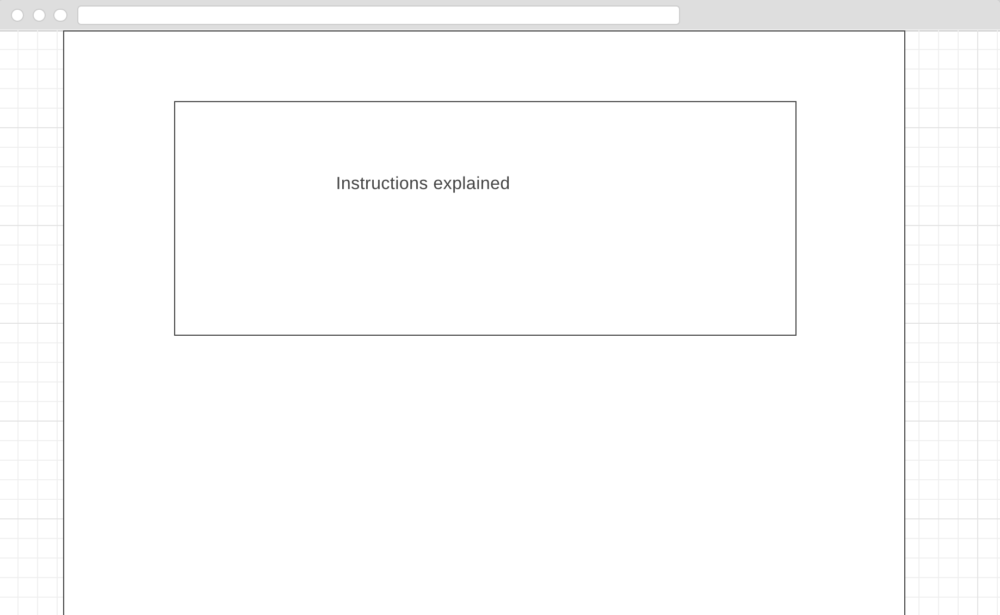
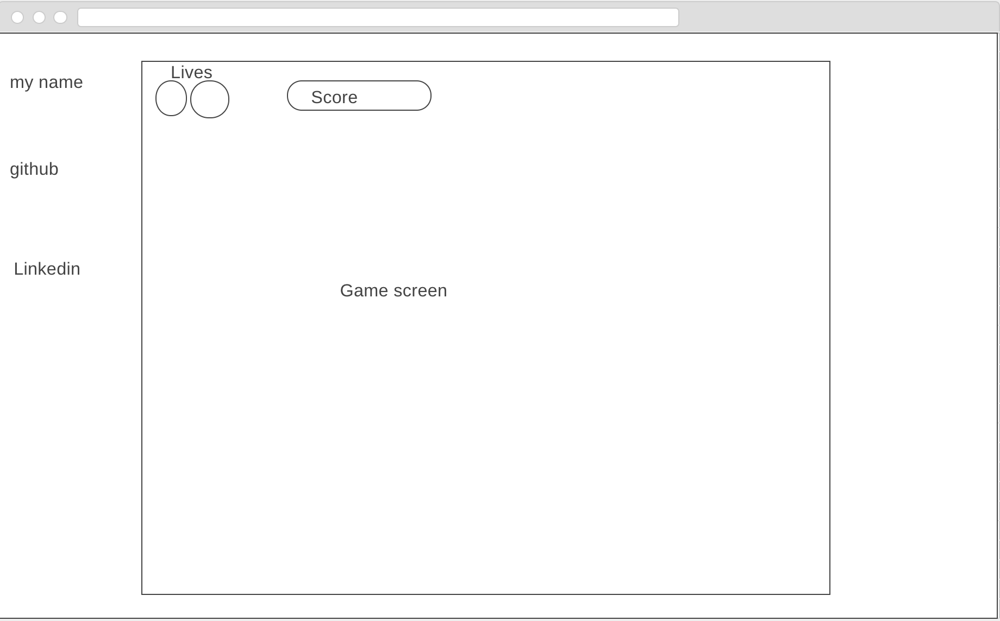

# Saviors
Due to a childhood fun of playing a famous arcade name known as 1941, Saviors was designed with such a game in mind. A live Implementation of Saviors can be found here: [Live](http://www.stevenossorio.com/Saviors/)

## How to play
The goal of the game is to continue dodging bullets fired by the aliens and try to gain as high a score as possible.

The game follows basic commands:
+ a - left
+ w - up
+ d - right
+ s - down
+ space - shoot
+ r - start/restart

These instructions can be found in the live version of the game as well.

## Technologies

The game functionality was created by the use of Vanilla JS ES6. It's visualization of a background panning and other design was done by using images/sprite packages and HTML Canvas.

## Difficulties

There were multiple complication when building Saviors but none the less solutions were found just as well. I'll list each issue that I came while building the game.

+ Panning Background
 + Even while using Canvas method drawImage and decreasing it's y axis, I wasn't getting the continues panning you'll normally get from the game. A solution was found by implementing two drawImages in order to maintain a much longer image play before background instance y variable was reset to the beginning.

+ Having an efficient game with so many instancing appearing.
 + Although having everything in a single canvas would have been possible, it wouldn't have been considered "efficient". Which is why there is a total of 5 canvases.
 + Separate canvases help have a better control on what is present when required. An example can be seen from the start, where there is only 2 instances (canvases) running which are the background and the startGame canvas.

+ Movement of Aircraft engines (enemies).
  + In order to use the sprite to it's full potential, I needed to figure out what was the heigh and width of each image. One it was none I had to implement an internal clock which would update the drawImage position to a different image which creates a moving effect.

+ Having a limited amount of bullets
  + Having a crazy amount of instances of a bullet class created a lag to the game. In order to speed up the process, the first step was to remove any bullets that either hit a target or leaves the canvas from the bullet array thus decreasing the amount of instances present. Next part was how to limit the amount of shots being shot from just holding space. This was done by creating an limitation present within the bullet array.

## Wireframes

### Waiting for player

### Instructions

### Game frame

