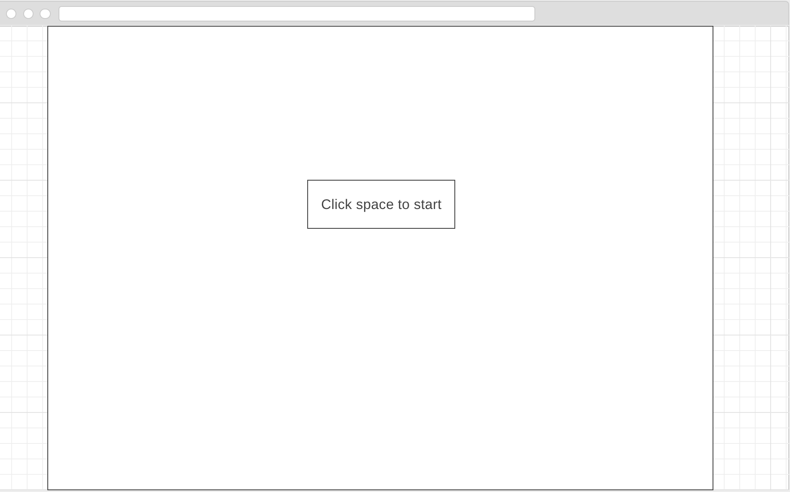

# Saviors
Saviors is a browser game where the player picks a fighter jet and fights there way up to the boss by shooting at the enemy and obtaining upgrades for more powerful weapons.

## MVP
Saviors will feature multiple enemies for the player to shoot at. It'll have a modal introduction and display sprites of the fighter moving around.

## Languages
This game will be build using Vanilla JS and HTML5.

## Wireframes

### Waiting for player

### Instructions

[/images/instructions.png]

### Game frame

[[/images/game.png]]

## Implementation Timeline
Day1:
 + Learn how to use Canvas
 + Learn to generate Sprite animation
 + Generate Modals

Day2:
 + Have player aircraft movement around the Canvas.
 + Write logic for keeping score.

day3:
 + Have basic movements completed for player aircraft
 + Have enemy aircraft appear on screen and disappear
 + Score should be calculated depending on aircraft shot

Day4:
  + Polish game logic
  + Include explosions to aircrafts between destroyed
